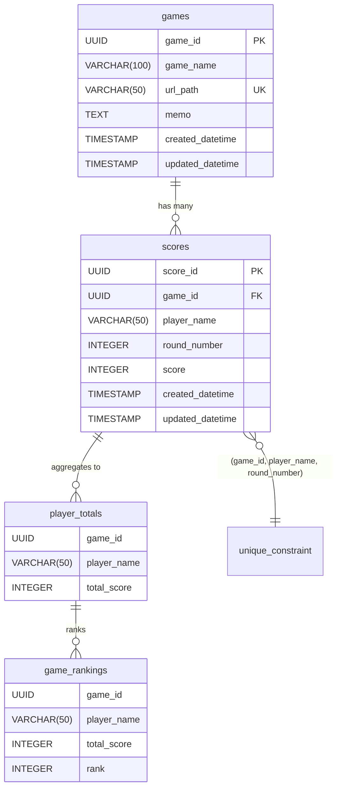

# ER Diagram

```mermaid
erDiagram
    games {
        UUID game_id PK
        VARCHAR(100) game_name
        VARCHAR(50) url_path UK
        TEXT memo
        TIMESTAMP created_datetime
        TIMESTAMP updated_datetime
    }

    scores {
        UUID score_id PK
        UUID game_id FK
        VARCHAR(50) player_name
        INTEGER round_number
        INTEGER score
        TIMESTAMP created_datetime
        TIMESTAMP updated_datetime
    }

    player_totals {
        UUID game_id
        VARCHAR(50) player_name
        INTEGER total_score
    }

    game_rankings {
        UUID game_id
        VARCHAR(50) player_name
        INTEGER total_score
        INTEGER rank
    }

    games ||--o{ scores : "has many"
    scores ||--o{ player_totals : "aggregates to"
    player_totals ||--o{ game_rankings : "ranks"

%% 複合ユニーク制約
    scores }o--|| unique_constraint : "(game_id, player_name, round_number)"
```
