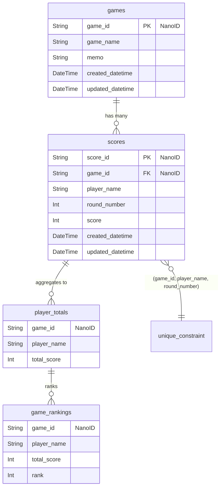

# ER Diagram

```mermaid
erDiagram
    games {
        String game_id PK "NanoID"
        String game_name
        String memo
        DateTime created_datetime
        DateTime updated_datetime
    }

    scores {
        String score_id PK "NanoID"
        String game_id FK "NanoID"
        String player_name
        Int round_number
        Int score
        DateTime created_datetime
        DateTime updated_datetime
    }

    player_totals {
        String game_id "NanoID"
        String player_name
        Int total_score
    }

    game_rankings {
        String game_id "NanoID"
        String player_name
        Int total_score
        Int rank
    }

    games ||--o{ scores : "has many"
    scores ||--o{ player_totals : "aggregates to"
    player_totals ||--o{ game_rankings : "ranks"

%% 複合ユニーク制約
    scores }o--|| unique_constraint : "(game_id, player_name, round_number)"
```
